# 🩺 AI and Women’s Health: Intelligent Platform for PCOS Detection and Personalized Diet Recommendations

This project is an **AI-powered health platform** dedicated to **women’s health and early diagnosis**.  
It helps women  with medical test results perform a **self-diagnosis before visiting a doctor**, understand their health situation, and receive **AI-driven medical insights**.  
Doctors can also use the platform to **accelerate the diagnostic process** and make it **more accurate and data-driven**.

The platform integrates **Machine Learning** , **Deep Learning** , and **Natural Language Processing (NLP)** models for disease detection, symptom analysis, and personalized dietary recommendations.  
It also provides a **comprehensive medical report (bilan)** summarizing all test results and AI-based health indicators.

> ⚠️ The full source code is private for academic confidentiality.  
> This repository contains **Concept diagram** , **sample folders**, **screenshots**, and a **demo video** for presentation purposes.

---

## 🚀 Key Features

- 👩‍⚕️ **Women’s Health Assistant:** Allows women  with medical test results to perform an early AI-based diagnosis before consulting a doctor.
- 🧠 **AI Disease Detection:** Detects PCOS and related complications using ML and DL models.  
- 🩺 **Comprehensive Medical Report (Bilan):** Generates a summary including all affected tests and AI evaluations.  
- 🧬 **Detects :**
  - Polycystic Ovary Syndrome (PCOS) = Syndrome des ovaires polykystiques (SOPK)
   **Complications**
  - Endometrial Cancer
  - Depression
  - Obesity
   **Similar diseases**
  - Type 2 Diabetes
  - Hypothyroidism
  - Chronic Kidney Disease
  
- 💬 **Intelligent Chatbot:** Detect depression using NLP.  
- 🍎 **Personalized Nutrition:** Suggests meal plans and recipes via the **Spoonacular API**.  
- 👨‍⚕️ **For Doctors:** Helps medical professionals speed up diagnosis and make it more precise with AI insights.  
- 🔐 **Authentication System:** Includes user registration, login, logout, and password reset.  
- 💻 **Web Interface:** Built with **React.js + Bootstrap 5** for an intuitive and responsive experience.
- 📈 **comprehensive medical report (bilan)**

---

## 🎥 Demo Video

🎬 Watch the full presentation here:  
[▶️ YouTube – SOPK IA Platform Demo](https://www.youtube.com/watch?v=cusfKSZi1do)

---
### 📄 Concept Diagram
[View Concept Diagram (PDF)](./screenshots/diagram.pdf)
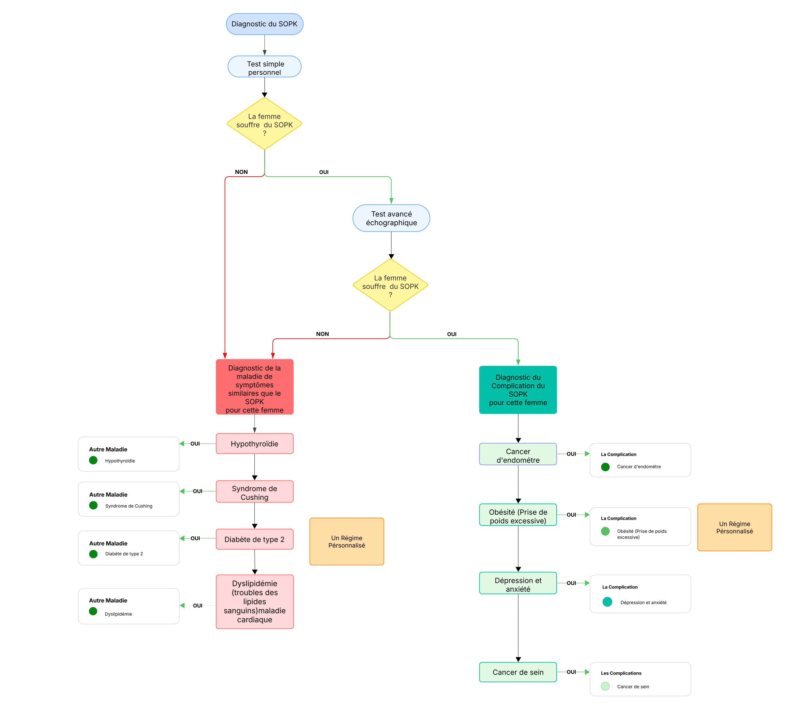

---

## 📸 Screenshots

### 🔑 Authentication
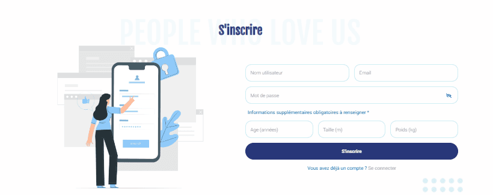
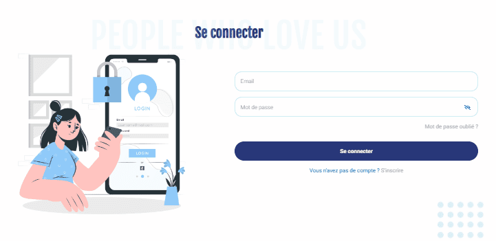
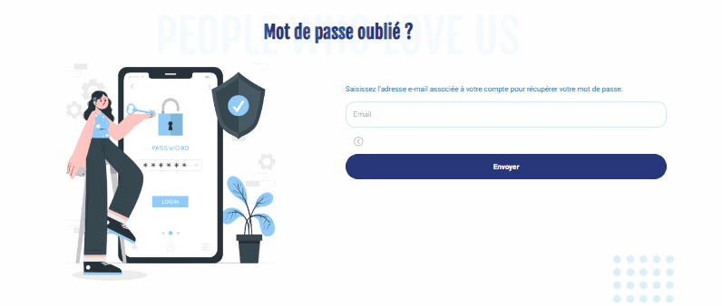
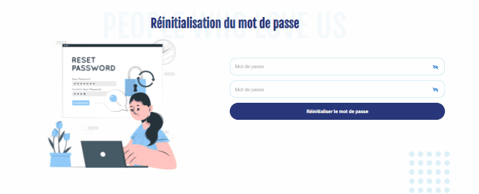

### 🩺 PCOS Detection
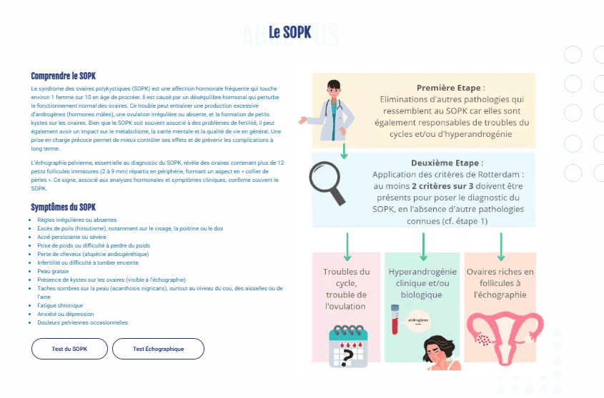
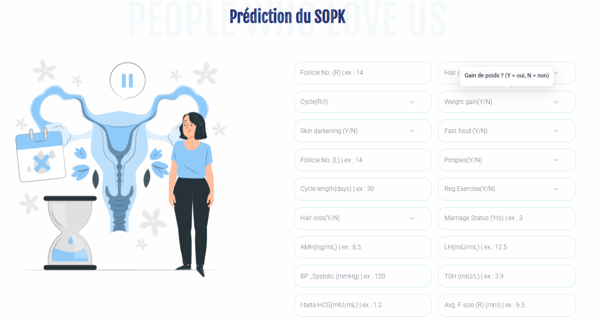

### 🥗 PCOS Diet
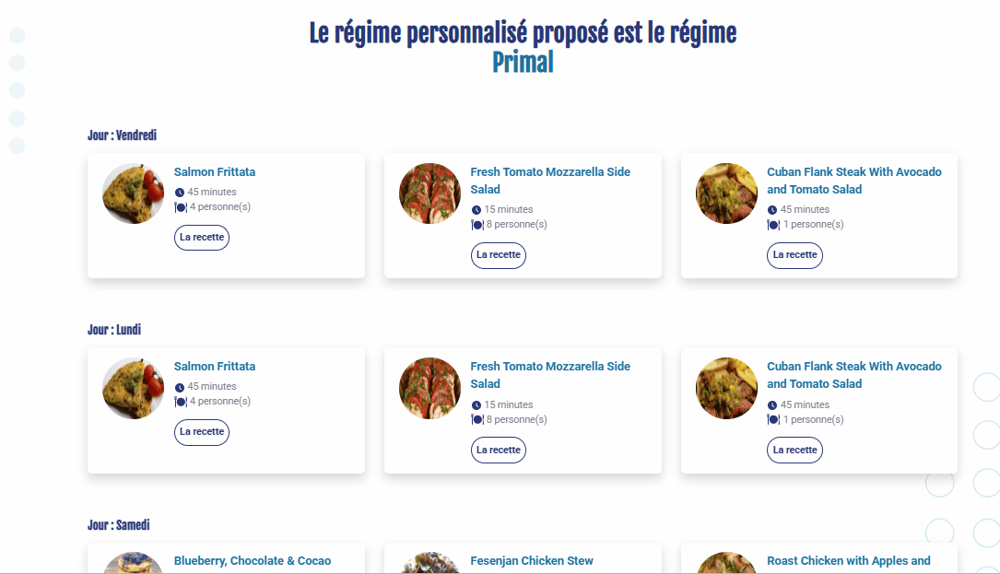

### 🧪 Medical Tests
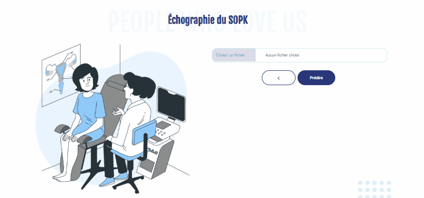

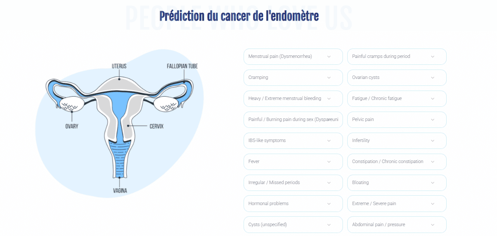

### 🧠 Depression Detection
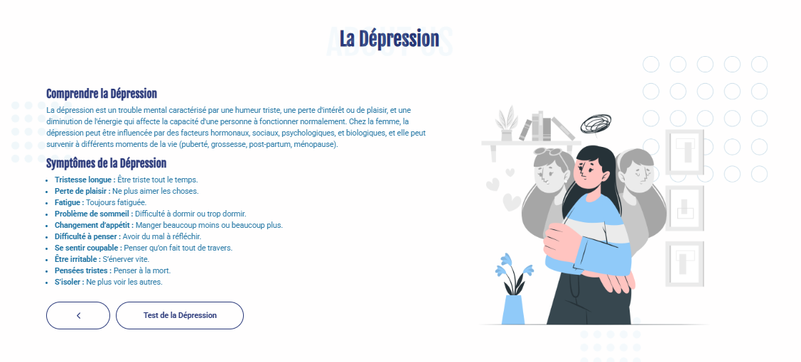
### 🧠 Intelligent Chatbot
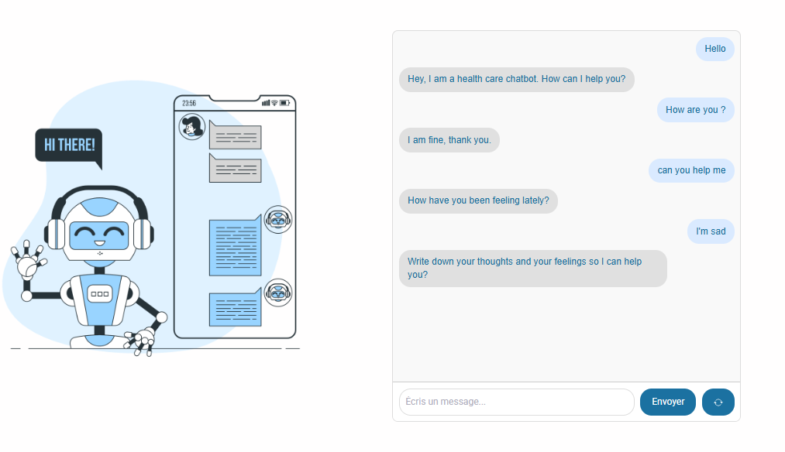

### 🩺 Endometrium Detection
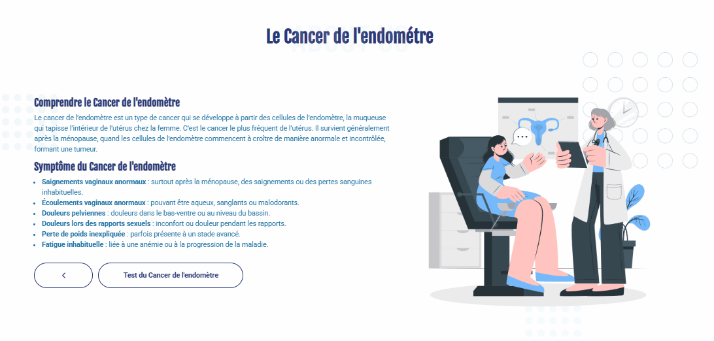

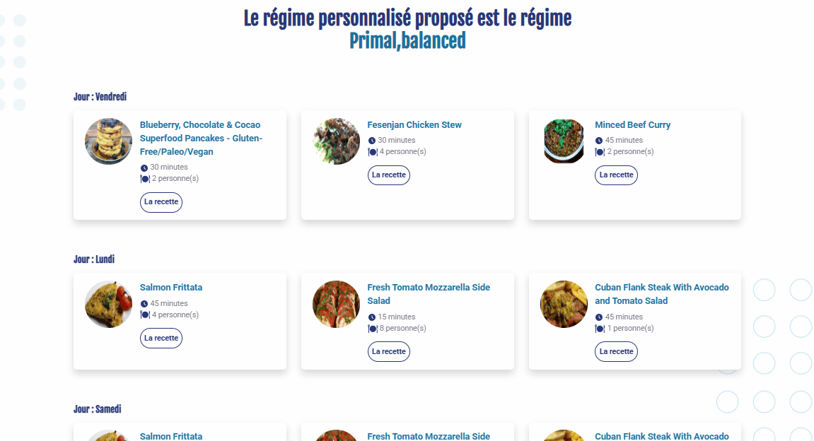

### 👤 User Profile
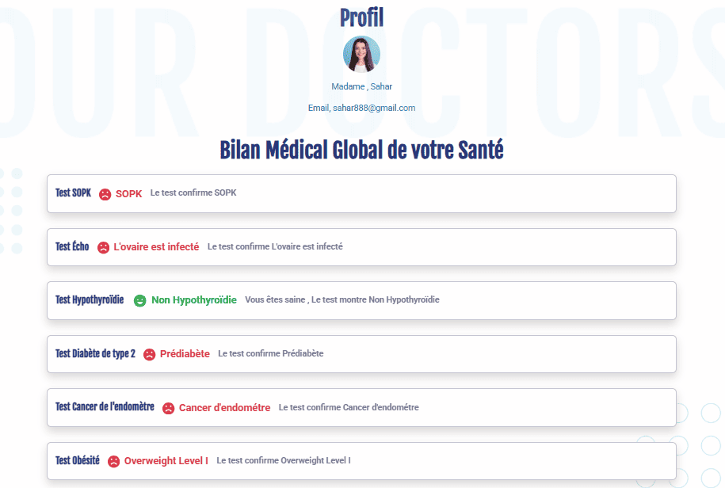

## 👩‍💻 Author

**N.Khazri**  
🎓 Final Year Project – 2025  
💡 *AI and Women’s Health: PCOS Detection & Personalized Nutrition Platform*  
🌐 [https://www.linkedin.com/feed/]

---

## ⚖️ License

All rights reserved © 2025 **N.Khazri**  
This repository is for **academic and presentation purposes only**.  

